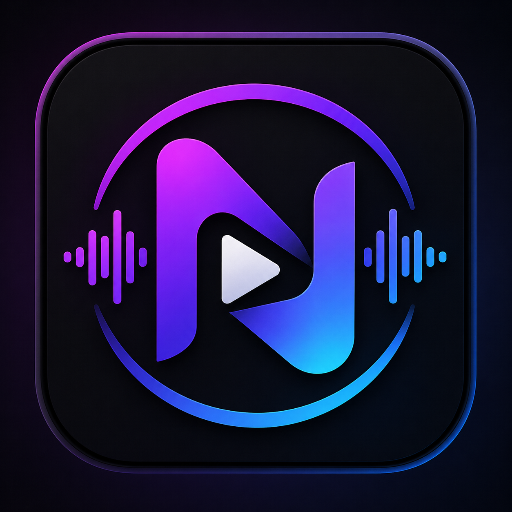

# 🎵 Nexora Player

<p align="center">
  
</p>

<p align="center">
  <strong>Your universe of sound & vision</strong><br/>
  Reproductor multimedia moderno para Android, enfocado en audio y video con una interfaz limpia, navegación rápida y reproducción en segundo plano.
</p>

<p align="center">
  
  
  
  
</p>

---

## ¿Qué es Nexora Player?

**Nexora Player** es una app multimedia para Android diseñada para reproducir música y video desde el almacenamiento del dispositivo con una experiencia visual moderna. La app combina una biblioteca local, un reproductor de audio con cola y favoritos, un reproductor de video con pantalla completa, búsqueda integrada y una sección de ajustes para personalizar el comportamiento general.

Está pensada para ofrecer una experiencia más pulida que un reproductor básico: portada de álbum o miniatura, información clara de la pista, controles visibles, navegación sencilla y reproducción continua en segundo plano.

---

## ✨ Lo que hace la app

### Música
- Lee música desde el dispositivo mediante integración con **MediaStore**.
- Muestra lista principal de canciones con portada cuando existe metadata disponible.
- Si una canción no tiene portada, usa un **fallback visual** dedicado.
- Abre una vista **Now Playing** con información ampliada de la pista.
- Incluye controles de reproducción, progreso, cola, favoritos e historial.
- Soporta reproducción en segundo plano mediante **Media3 / ExoPlayer**.
- Permite ocultar canciones de la lista principal y restaurarlas después desde Ajustes.
- Permite añadir canciones a playlists y gestionar listas de reproducción.

### Video
- Explora archivos de video del dispositivo.
- Abre un reproductor dedicado con diseño más profesional.
- Soporta pantalla completa real.
- Incluye gestos para controlar brillo y volumen desde la pantalla.
- Muestra miniatura o portada del video cuando está disponible.

### Búsqueda
- Búsqueda integrada sobre la biblioteca multimedia.
- Campo compacto con icono de lupa.
- La interfaz prioriza espacio útil para el saludo y el nombre de la app.

### Ajustes
- Enlaces directos a la plataforma del desarrollador.
- Sección informativa detallada sobre todo lo que hace la app.
- Opción para restablecer elementos ocultos.
- Texto legal y descriptivo indicando que la app es gratuita y no está a la venta.

### Experiencia visual
- Tema oscuro con identidad visual propia.
- Saludor dinámico según el momento del día.
- Pantalla de inicio animada.
- UI más cercana a un reproductor moderno tipo streaming, pero con diseño propio.

---

## 🧩 Funciones principales

- Reproducción de audio local.
- Reproducción de video local.
- Portadas de música y miniaturas de video.
- Reproducción en segundo plano.
- Cola de reproducción.
- Favoritos.
- Historial.
- Playlists.
- Ocultar y restaurar canciones.
- Búsqueda rápida.
- Ajustes con información ampliada.
- Interfaz moderna basada en Jetpack Compose.

---

## 🏗️ Estructura del proyecto

```text
nexora-player/
├── app/
│   └── src/main/
│       ├── java/com/nexora/player/
│       │   ├── MainActivity.kt
│       │   ├── NexoraApplication.kt
│       │   ├── AppViewModel.kt
│       │   ├── data/
│       │   │   ├── local/
│       │   │   ├── model/
│       │   │   ├── preferences/
│       │   │   └── repository/
│       │   ├── playback/
│       │   │   ├── PlayerEngine.kt
│       │   │   └── PlayerService.kt
│       │   └── ui/
│       │       ├── components/
│       │       ├── navigation/
│       │       ├── screens/
│       │       └── theme/
│       └── res/
│           ├── drawable/
│           ├── mipmap-anydpi-v26/
│           └── values/
├── .github/workflows/
│   └── build.yml
├── README.md
└── ignore/icon.png
```

---

## 🛠️ Stack técnico

- **Kotlin**
- **Jetpack Compose**
- **Material 3**
- **Media3 / ExoPlayer**
- **Room**
- **DataStore / Preferences**
- **MediaStore**
- **GitHub Actions** para compilación y releases

---

## 👤 Autor y créditos

**CHICO-CP (Ghost Developer)**

---

## ⚠️ Aviso

Este proyecto es **gratuito** y **no está a la venta**.

Todos los derechos reservados a **Ghost Developer**.
